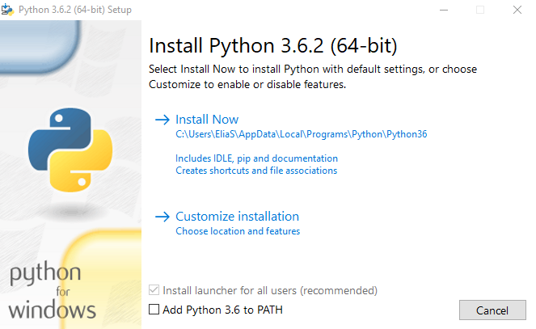
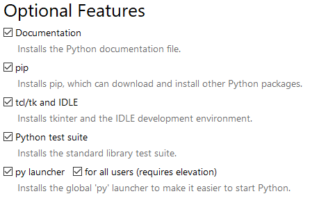

# Manual Flask

[TOC]


## Instalación

En Windows la instalación es muy facil, sólo se necesita descargar alguna versión de python de su página oficial, en sus versiones mayores a 3.0. Al ejecutar el archivo, nos abrirá una ventana la de la cual seleccionaremos la opción de agregar al PATH (`Add Python 3.x to PATH`), y procederemos con la instalación personalizada (`Customize installation`)



Nos aseguraremos de elegir la opción de `pip` para que podamos instalar paquetes.



En Linux la instalación es más fácil, en las versiones más recientes tanto de Ubuntu o Debian, las versiones de python3 ya está habilitada por default.  Lo único que hay que hacer es instalar el paquete de flask.

Para instalar pip en Linux deberemos escribir en terminal:

```
sudo apt-get install python3-pip
```

### El entorno virtual

Si deseamos utilizar un entorno virtual, que es lo más recomendable, entonces escribiremos los sigueinte para instalar el paquete:

En Windows:

```bash
pip install virtualenv
```

En linux la instalación se hace desde los sources de tu distribución.

```bash
sudo apt-get install virtualnev
```

Una vez instalado, para crear un entorno virtual escribiremos:

```bash
virtualenv -p python3 entorno
```

Para activar el entorno bastará escribir las siguientes lineas:

En windows:

```bash
cd entrono
/Scripts/activate.bat
```

El resultado será el siguente:

```bash
(entorno) C:\Entornos-Virtuales\entorno\Scripts>
```

**Nota**: Previamente debiste haber creado bajo `C:\` el directorio `Entornos-virtuales` 

En linux:

```bash
source entorno/bin/activate
```

El resultado será:

```
(entorno) usuario@pcname:~$
```

Dentro del entorno podremos instalar el paquete flask para no utlizarlo de forma global. Tanto en Windows como en las distros de Linux, lo único que debemos poner en terminal es el comando de instalación del paquete.

```bash
pip3 install flask
```

Para desactivar el entorno virtual sólo escribiremos:

```bash
deactivate
```


## Hola mundo

Código base de flask

````python
# Archivo app.py

from flask import Flask 

app = Flask(__name__)

@app.route("/") #Decorador de Ruta
def index():
    return "Hola mundo"

if __name__=="__main__":
    app.run()
````

Decorador de Ruta indica la dirección a través de la cual vamos a poder acceder desde el navegador.

La primer línea indica que del modulo de `flask` se importará la clase `Flask`

```python
from flask import Flask
```

 La función index devolverá la cadena "Hola mundo"

```python
def index():
```

Para ejecuar la aplicación escribirmos

```bash
python app.py
```

Al crear archivos de python se generan variables especiales, automáticamente. La vairable `__name__` almacena el nombre del modulo en el que nos encontramos, el modulo se llama `app.py`, se le remueve la extension y sólo almacena `app`.

La viariable `__main__`indica que es un modulo principal, la siguiente condición indica que `__name__` pasa a ser un modulo principal.

```python
if __name__=="__main__":
```


## Función Run

Los parámetros que puede recibir la función pueden ser `debug`, `port` y `host`

El modo debug, indica que el modo debug está activo, de esta manera los cambios de nuestra aplicación se mostraran de forma automática sin reniciar el servidor.

```python
app.run(debug=True)
```

El parametro port, indica bajo que puerto deseamos que se ejecute el servidor, por default se maneja el puerto `5000`. Y por último.

```python
app.run(port=80)
```

El parametro host, Indica bajo que dirección IP o dominio se mostrará la aplicación.

```python
app.run(host=127.0.1.1)
```

En el siguiente ejemplo, se meuestra una configuración en desarrollo, bajo el puerto 80, para que pueda correr bajo este puerto, no deberá estar instalado en el servidor o en tu computadora ningun otro servidor que apunte a esta dirección tales como apache2/httpd, nginx, etc. Y por último, está ejecutandose bajo el dominio one.lan.

```python
app.run(debug=True, port=80, host=one.lan)
```

La configuración en linux se hace en el archivo /etc/hosts.

```bash
127.0.0.1	one.lan		usuario
```

Mientras que en Windows se hace en la ruta `c:\windows\system32\drivers\etc\hosts`, y no se necesita agregar otro parametro más que la ip y el nombre de dominio.

```bash
127.0.0.1	one.lan
```

## Url's

El decorador de ruta indica, precisamente, la ruta en la cual se mostrará la función que queremos ejecutar.

Por ejemplo, para mostrar la raíz de nuestra web simplemente colocaremos:

```python
@app.route("/")
```

Si queremos mostrar one.lan/hola, nuestro decorador deberá ser el siguiente:

```python
@app.route("/hola")
```

También podemos hacer uso de variables:

```python
@app.route("/user/<string:user>")
def user(user):
	return "hola " + user
```

Otro ejemplo es una variable de tipo entero:

```python
@app.route("/numero/<int:n>")
def numero(n):
	return "numero: {}".format(n)
```

```python
@app.route("/user/<int:id>/<string:username>")
def username(id,username):
	return "ID: {}, Nombre de usuario: {}".format(id, username)
```

Con numeros flotantes:

```python
@app.route("/suma/<float:n1>/<float:n2>")
def numero(n1,n2):
	return "El resultado de la suma es: {}".format(n1 + n2)
```

```
http://one.lan/suma/1.0/1.0
El resultado de la suma es: 2.0
```

### Dobles decoradores

Podemos poner tantos decoradores como queramos, es decir, una funcion que se muestre en varias rutas:

```python
@app.route("/default/")
@app.route("/default/<string:dft>")
def dft(dft="valor"):
	return "El valor de dft es: {}" + dft
```

En el ejemplo se le asigna un valor, que literalmente se llama "valor" a la variable dft.

## Archivos Estáticos

 Los archivos estaticos son los elementos tales como css, js e imagenes. para crear el arbol del directorio es necesario escribir en nuestra terminal:

```bash
mkdir static
```

Entramos a nuestra carpeta que recien creamos, la cual se llama static. Y dentro de static crearemos los siguientes directorios:``

```bash
mkdir css js imgs 
```

Ahora bien, cuando ejecutamos nuestro servicio de flask, nos muestra el siguiente error:

```bash
127.0.0.1 - - [01/Jun/2020 11:28:23] "GET /favicon.ico HTTP/1.1" 404 -
```

Este error sucede porque noencuentra el archivo `favicon.ico`, el cual es un icono que deberemos poner en la ruta `/static/imgs/` dado que icono es un tipo de imagen.

El arbol de directorios quedará así:

```bash
.
├── app.py
└── static
    ├── css
    │   └── style.css
    ├── img
    │   └── favicon.ico
    └── js
        ├── main.js
        └── main.min.js
```

## Vistas

Lo primero que crearemos es una carpeta llamada `templates` dentro del directorio de nuestro proyecto, quedando `static` y la presente carpeta dentro del directorio actual. 

Para rendreizar los archivos importaremos la clase `render_template` a nuestro archivo `app.py`.

```python
from flask import Flask, render_template
```

Y modificaremos la función `index` la funcion ya no devolverá la cadena de texto `hello world`, ahora devolverá un archivo de `html`. remplazaremos el texto `hello world` por lo siguiente:

```python
@app.route("/")
def index():
	return render_template("index.html")
```

La función `render_template` buscará la carpeta llamada `templates` en donde estarán los archivos `html` que daran vista a nuestro proyecto.

Lo siguiente que haremos será crear el archivo `index.html` dentro de la carpeta `templates:`

```html
<!DOCTYPE html>
<html>
<head>
    <meta charset="UTF-8">
    <title>Document</title>
</head>
<body>
    <h1>
        Welcome!
    </h1>
</body>
</html>
```

  Vamos a usar una ruta relativa para mostrar nuestro favicon.ico 

```html
<link  rel="shortcut icon" href="../static/imgs/favicon.ico">
```

## Sintaxis de Jinja2

JInja2 nos permite intercambiar datos desde el backend hacia en frontend, tambien nos permite manejar los datos dentro de nuestras plantillas html.

```python
@app.route("/")
def index():
titulo = "Home!"
	return render_template("index.html")
```

Para compartir la variable `titulo` y su valor con nuestra vista, debemos pasar esa variable como argumento dentro de la funcion `render_template`.

```python
return render_template("index.html", titulo=titulo)
```

Siendo la primer palabra, de titulo, la variable como nos vamos a referir dentro del archivo html.

```jinja2
<body>
    <h1>
        {{ titulo }}
    </h1>
</body>
```

### Sentencias o instrucciones de Jinja2

Listar valores:

```python
@app.route("/")
def index():
lista = ["footer","header","info"]
titulo = "Home!"
	return render_template("index.html", titulo=titulo, lista=lista)
```

```jinja2
<body>
    <h1>
        {{ titulo }}
    </h1>
    
    <p>{{ value }}</p>
    
</body>
```

Ruta relativa con jina2:

```jinja2
<link  rel="shortcut icon" href="{{ url_for('static', filename='imgs/favico.ico') }}">
```

### Declaración de bloques en jinja2

Jinja2 nos permite declarar bloques, como plantillas base, para no generar nuevas plantilas y reutilizar un archivo. Crearemos un archivo de nombre base.html.

```jinja2
<!DOCTYPE html>
<html>
<head>
    <meta charset="UTF-8">
    <title>Document</title>
</head>
<body>
    
    
</body>
</html>
```

El archivo `index.html` lo modificamos, borraremos todo el contenido y escribiremos lo siguiente:

```jinja2

```

Esta plantila se va a generar a partir del archivo `base.html`

```jinja2


    <h1> {{ titulo }} </h1>
    
    <p>{{ value }}</p>
    

```

Podemos declarar tos bloques como queramos dentro de nuestra plantilla, por ejemplo:

Archivo `base.html`

```jinja2
<head>
    <meta charset="UTF-8">
    <title></title>
</head>
```

Archivo `index.html`

```jinja2


Index


    <h1> {{ titulo }} </h1>
    
    <p>{{ value }}</p>
    

```

## Bases de Datos en Flask

Conexión a la base de datos:

 Lo primero es instalar la librería

```bash
pip install flask_sqlalchemy
```

Dentro de nuestro archivo app.py importamos la libreria de SQLAlchemy

```python
from flask_sqlalchemy import SQLAlchemy
```

Agregaremos la llamada a la base de datos

```python
app = Flask(_name_) 
db = SQLAlchemy(app)
```

Se toma el nombre del modulo como parametro de la función `SQLALchemy`

Lo siguiente es hacer algunas configuraciones para indicar la ruta de la base de datos y para evitar que salgan errores:

```python
app.config["SQLALCHEMY_DATABASE_URI"] = dbdir
app.config["SQLALCHEMY_TRACK_MODIFICATIONS"] = Flase
```

Ahora vamos a poner la ruta absoluta de la base de datos, lo primero es importar os:

```python
import os
```

Ahora vamos a crear la variable seguido del conector

``` python
dbdir = "sqlite:///" + os.path.abspath(os.getcwd()) + "/basededatos.db"
```

Ahora le deberemos indicar que si no existe la base de datos, la cree con la siguiente instrucción:

```python
if __name__=="__main__":
	db.create_all()
	app.run(debug=True)
```

Ahora vamos a crear una tabla:

```python
class Post(db.Model):
    id = db.Column(db.Integer, primary_key=True)
    title = db.Column(db.String(50))
```

Crearemos otra ruta para insertar datos:

```python
@app.route("/insert/default")
def insert_default():
    new_post = Post(title="Default title")
    db.session.add(new_post)
    db.session.commit()
    return "El post fue creado"
```

Para hacer una consulta:

```python
@app.route("/select/default")
def select_default():
    post = Post.query.filter_by(id=1).first()
    print(post.title)
    return "Query done."
```

## Formularios

Para este ejemplo vamos a trabajar con los siguientes archivos.

Código `index.html`

```jinja2


Home


<h1>Welcome!</h1>
<form method="get" action="{{ url_for('search') }}">
<p><input type="text" name="nickname"></p>
<input type="submit" value="Search">
</form>

```

Código `signup.html`

```jinja2


Sign Up


<h1>Sign Up</h1>
<form method="post" action="{{ url_for('signup') }}">
<p><input name="username" type="text"></p>
<p><input name="password" type="password"></p>
<input type="submit" value="Sign Up">
</form>

```

A partir del código `signup.html` crearemos `login.html`, lo único que cambiaremos es todo el texto de Sign Up por Login, además la función de la acción debe tener lo siguiente: 

```jinja2
<form method="post" action="{{ url_for('login') }}">
```

Nuestro archivo `app.py` debe estar el esqueleto para trabajar con bases de datos.

```python
from flask import Flask, render_template
from flask_sqlalchemy import SQLAlchemy
import os

dbdir = "sqlite:///" + os.path.abspath(os.getcwd()) + "database.db"

app = Flask(__name__)
app.config["SQLALCHEMY_DATABASE_URI"] = dbdir
app.config["SQLALCHEMY_TRACK_MODIFICATIONS"] = True
db = SQLAlchemy(app)

if __name__=="__main__":
    db.create_all()
    app.run(debug=True)
```

### Sistema de registro de usuarios

Vamos a crear un **sistema de registro de usuarios**, así que procederemos a crear nuestra *clase* `users`.

```python
class Users(db.Model):
    id = db.Column(db.Integer, primary_key=True)
    username = db.Column(db.String(50), unique=True, nullable=False)
    password = db.Column(db.String(80), nullable=False)
```

- El atributo `unique` nos indica que no existirán registros similares.
- El atrubuto `nullable` nos indica que no puede ir en blanco su valor.

Vamos a crear la primer ruta:

```python
@app.route("/signup")
def signup():
    pass
```

Las rutas están preparadas para recibir una petición de tipo `GET`, pero en nuestros formularios de regitro e inicio de sesión se mandan a través del método `POST`, así que debemos configurar la ruta para que pueda recibir el método `POST` o ambos. En el argumento de la ruta, el pasamos una lista llamada methods y se configurará de la siguiente manera. 

```python
@app.route("/signup", methods=["GET", "POST"])
```

Para poder diferenciar cuando se envia una peticion `GET` o `POST` deberemos importar una clase de modulo de flask

```python
from flask import Flask, render_template, request

```

Y creamos la condicional:

```python
if request.method == "POST":
 
return render_template("signup.html") # Si no se cumple    
```

Primero debemos importar algunas funciones:

```python
from werkzeug.security import generate_password_hash, check_password_hash
```

Ahora debemos hacer es cifrar la contraseña:

```python
hashed_pw = generate_password_hash(request.form["password"], method="sha256")
```

Vamos a construir el objeto que vamos a almacenar en la base de datos:

```python 
new_user = Users(username=request.form["username"], password=hashed_pw)
db.session.add(new_user)
db.session.commit()

return "Ya estás regsitrado exitosamente"
```

 Vamos a crear la ruta de login

```python
@app.route("/login", methods=["GET","POST"])
def login():
    if request.method == "POST":
         user = Users.query.filter_by(username=request.form["username"]).first()
         if user and check_password_hash(user.password, request.form["password"]):
            return "Tú ya estas logueado"
        return "Tus credenciales son invalidas, revisa de nuevo"
    return render_template("login.html")
```

Vamos a usar el método `GET:`

```python
@app.route("/")
def index():
    return render_templeate("index.html")

@app.route("/search")
def search():
    nickname = resquest.args.get("nickname")
    user = Users.query.filter_by(username=nickname).first()
    if user:
        return user.username
    return "El usuario no existe"
```

## Manejo de Cookies

```python
from flask import Flask, render_template, request

app = Flask(__name__)

@app.route("/") 
def index():
    return "Hola mundo"

if __name__=="__main__":
    app.run(debug=True)
```

Vamos a agregar una nueva clase del modulo flask, esta se llama make_response

```python
from flask import Flask, render_template, request, make_response 
```

Ahora vamos a crear una nueva ruta:

```python
@app.route("/cookie/set")
def set_cookie():
    resp = make_response(render_template("index.html"))
    return resp
```

Nuestra variable resp se ha convertido en un objeto por recibir la función `make_response()`;  Vamos a utilizar uno de sus metodos, `set_cookie`, para crear nuestra cookie.

```python
resp.set_cookie("username", "Usuario")
```

Este método como primer parametro recibe el nombre de nuestra cookie, en este caso es `username`; como segundo parametro va a recirbir, el valo que le asignaremos a nuestra cookie, que este caso es `Usuario`.

Ahora, la página nos mostrará como respuesta, entraremos en ella para generar la cookie:

```html
<!DOCTYPE html>
<html lang="en">
<head>
    <meta charset="UTF-8">
    <meta name="viewport" content="width=device-width, initial-scale=1.0">
    <meta http-equiv="X-UA-Compatible" content="ie=edge">
    <title>Document</title>
</head>
<body>
    <h1>
        La cookie ha sido creada
    </h1>
</body>
</html>
```

 Ahora vamos a comprobar si la cookie ha sido creada:

```python
@app.route("/cookie/read")
def read_cookie():
    username =request.cookies.get("username", None)
    return username
```

Esto nos debe regresar el valor de nuestra cookie, que en nuestro caso es `Usuario`.

  Para ver el funcionamiento de None, entonces agregamos:

```python
@app.route("/cookie/read")
def read_cookie():
    username =request.cookies.get("username", None)
    if username==None:
        return "la cookie no existe"
    return username
```

## Uso de Sesiones

Importamos las siguientes librerias

```python
from flask import Flask, render_template, request, session, escape
```

Con el siguiente código nos permitirá saber si el usuario está logueado o no

Modificaremos la ruta de login, donde se realiza la comprobacion entre los datos que se ingresan en el formulario y los que hay almacenados en la base de datos:

```python
if user and check_password_hash(user.passowrd, request.form["password"]):
    session["username"] = user.username
```

Para ver el reusltado, crearemos unanueva ruta:

```python
@app.route("/home")
```

La cual deberá contener el siguiente código

```python
def home():
    if "username" in session:
        return "You are %s" % escape(session["usename"])
    return "Debes loguearte primero"
```

El `for` indica que si dentro de session existe la cookie llamada session. La expresión `%s` indica que vamos a formaterlo con una cadena de texto.

Ahora bien necesitareos una llve secreta

```python
app.secret_key = "cadena_secreta_de_caracteres_es_decir_un_hash"
```

Ahora vamos a crear una ruta que nos permita desconectarnos, es decir, esta función nos permite cerrar una sesión.

```python
@app.route("/logout")
def logout():
    session.pop("username",None)
    return "Estas deconectado"
```

## Funciones redirect y url_for

Importaremos las funciones que vamos a necesitar:

```python
from flask import Flask, redirect, url_for
```

vamos a crear una nueva ruta

```python
@app.route("/start")
def start():
    return url_for("index") 
```

La función `url_for` apunta a otra función que esté contenida dentro de una ruta, dentro de una decorador de ruta.

```python
# función anterior
@app.route("/")
def index():
    return "Hola mundo!"
```

 El resultado será `/` la función `url_for` regresará la cadena de texto de la url a la que está apuntando, regresrá su ruta que es la raíz ya que es la función `index`.

Si pasamos el siguiente parametro:

```python
return url_for("start", next="login" ) # El resultado será /start?next=login
```

Es un formato de url basado en el método `GET`

Ahora veremos el uso de la función `redirect`, la cual como su nombre indica nos redireccionara a alguna página o ruta en especifico.

```python
@app.route("/redireccion")
def redireccion():
    return redirect("https://www.google.com")
```

Uso de los dos en conjunto:

```python
@app.route("/post/<int:id>")
def post(id):
    return "Mostrando post: {}".format(id)
@app.route("/today") # El post de hoy
def today():
    return redirect(url_for("post", id=50, next=edit))
```

El resulatdo será

```bash
Mostrando post: 50
```

Y el navegador mostrará la ruta

```bash
/post/50?next=edit
```

## Message Flashing


